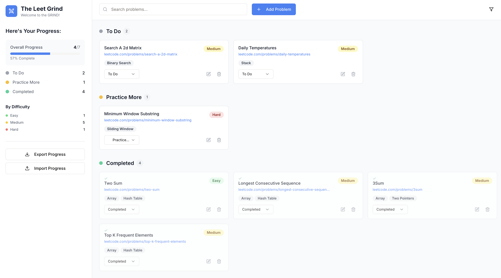

# The Leet Grind: A Leetcode Progress Tracker

## Overview

Welcome to the grind! The Leet Grind is a LeetCode problem tracking application that helps users organize and monitor their coding practice progress. The application allows users to add LeetCode problems, categorize them (To Do, Practice More, Completed), and track their overall progress with visual statistics.

The application is built as a full-stack web application with a React frontend and Express.js backend, designed to run on Replit with PostgreSQL database support.

## System Architecture

### Frontend Architecture
- **Framework**: React 18 with TypeScript
- **Routing**: Wouter for lightweight client-side routing
- **State Management**: TanStack Query (React Query) for server state management
- **UI Components**: shadcn/ui component library built on Radix UI primitives
- **Styling**: Tailwind CSS with custom design tokens
- **Build Tool**: Vite for fast development and optimized production builds

### Backend Architecture
- **Framework**: Express.js with TypeScript
- **Database**: PostgreSQL with Drizzle ORM (In Progress)
- **Session Management**: Express sessions with PostgreSQL store
- **Validation**: Zod for runtime type validation
- **Development**: TSX for TypeScript execution in development

## Key Components

### Data Storage Strategy
The application implements a dual storage approach:
1. **Local Storage**: Currently used for client-side data persistence
2. **Database Layer**: PostgreSQL backend ready for production use

The storage interface (`IStorage`) allows switching between storage backends without changing business logic.

### Problem Management
- **URL Validation**: Strict validation for LeetCode problem URLs
- **Category System**: Three-tier categorization (To Do, Practice More, Completed)
- **Progress Tracking**: Real-time statistics and progress visualization

### User Interface
- **Responsive Design**: Mobile-first approach with desktop enhancements
- **Component Library**: Consistent UI using shadcn/ui components
- **Dark Mode Ready**: CSS variables configured for theme switching
- **Accessibility**: Built on Radix UI primitives for screen reader support

## Data Flow

1. **Problem Addition**: User enters LeetCode URL → Frontend validates URL → Extracts problem details → Stores in database
2. **Progress Updates**: User changes problem category → Frontend updates local state → Syncs with backend
3. **Statistics**: Real-time calculation of progress metrics from problem data
4. **Data Persistence**: Local storage backup with database sync capability

## External Dependencies

### Core Dependencies
- **@neondatabase/serverless**: PostgreSQL connection for serverless environments
- **drizzle-orm**: Type-safe ORM for database operations
- **@tanstack/react-query**: Server state management and caching
- **wouter**: Lightweight routing library
- **zod**: Runtime type validation

### UI Dependencies
- **@radix-ui/***: Accessible UI primitive components
- **tailwindcss**: Utility-first CSS framework
- **class-variance-authority**: Utility for conditional CSS classes
- **lucide-react**: Icon library

### Development Dependencies
- **vite**: Build tool and development server
- **tsx**: TypeScript execution for Node.js
- **drizzle-kit**: Database migration and schema management

## Deployment Strategy

### Replit Configuration
- **Runtime**: Node.js 20 with PostgreSQL 16 module
- **Development**: `npm run dev` starts both frontend and backend
- **Production**: Vite build followed by esbuild for server bundling
- **Port Configuration**: Frontend on port 5000, mapped to external port 80

### Build Process
1. **Frontend Build**: Vite compiles React app to `dist/public`
2. **Backend Build**: esbuild bundles Express server to `dist/index.js`
3. **Static Serving**: Production server serves built frontend assets

### Database Setup
- PostgreSQL module auto-provisioned in Replit
- Drizzle migrations handle schema updates
- Environment variable `DATABASE_URL` required for database connection

## Planned Features

1. **Live Database**: I am planning to create a PostgreSQL database in the future. This will allow users to create an account and save their Leet Grind progress. For now, it saves in local storage.